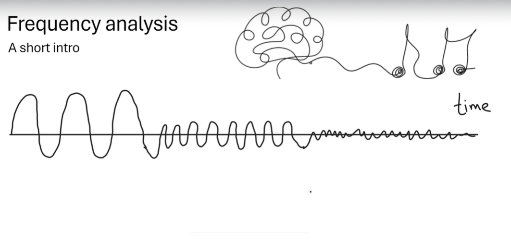
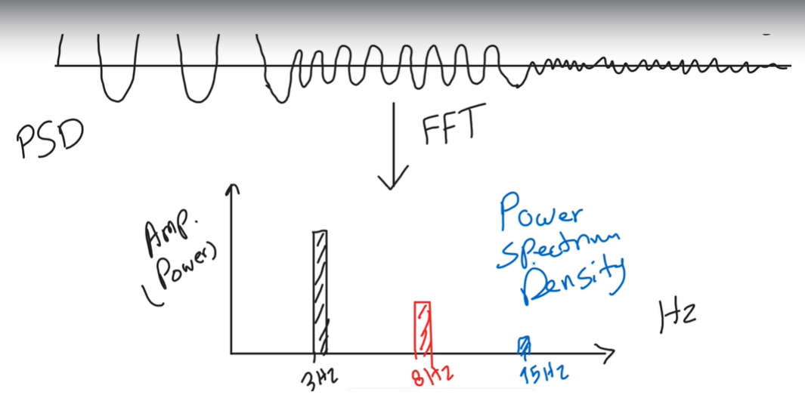

## 2. Brain Waves and Their Frequencies

### 2.1 Frequency and Period

- **Frequency (f)**: Number of cycles a wave completes per second.
- **Period (T)**: Time taken for one complete cycle.

---

### 2.2 Categories of Brain Waves

| **Wave Type** | **Frequency Range (Hz)** | **State**                          | **Significance**                                          |
| ------------- | ------------------------ | ---------------------------------- | --------------------------------------------------------- |
| Delta         | 1–4                      | Deep sleep                         | Restorative functions, indicates healing.                 |
| Theta         | 4–8                      | Light sleep, creativity            | Memory processing, creativity, and relaxation.            |
| Alpha         | 8–12                     | Relaxation, awake states           | Idling state of the brain, often in the occipital region. |
| Beta          | 13–30                    | Focus, cognitive tasks             | High mental activity and focused attention.               |
| Gamma         | >30                      | Complex cognition, sensory binding | Linked to consciousness, perception, and learning.        |

---

### 2.3 Mathematical Representation

A wave can be represented as:

x(t) = A sin(2π f t + φ)

- **A**: Amplitude (height of the wave).
- **f**: Frequency (cycles per second).
- **t**: Time.
- **φ**: Phase (starting point of the wave).

#### Example: Delta and Alpha Wave Comparison

- **Delta**: \( f = 2 \, \text{Hz}, A = 5 \)

x_delta(t) = 5 sin(4π t)

- **Alpha**: \( f = 10 \, \text{Hz}, A = 3 \)

**Interpretation**: Delta waves have a lower frequency but higher amplitude, signifying slower but stronger oscillations.

---

## 3. Amplitude and Power

### Amplitude

- The height of a wave from its baseline to its peak.
- Reflects the strength of brain activity.

### Power Spectral Density (PSD)

- **Power** measures energy distribution across frequencies.
- Formula:

P(f) = A^2

#### Example:

- For \( A = 3 \):

## 4. One-over-f Rule

- Describes the relationship between frequency and amplitude in EEG:

A ∝ 1 / f

### Interpretation:

- Higher frequency → Lower amplitude.
- Reflects energy conservation in the brain.

#### Example:

- For \( A = 10 / f \):
- At \( f = 2 \, \text{Hz} \): \( A = 5 \).
- At \( f = 20 \, \text{Hz} \): \( A = 0.5 \).

---

## 5. Event-Related Potentials (ERP)

### Definition

ERPs are brain responses to specific events (e.g., stimuli or tasks). They reflect sensory, motor, or cognitive processing.

### Key Features

1. **Latency**: Time delay between stimulus and response.

Latency = t_response - t_stimulus

2. **Amplitude**: Reflects the intensity of the brain’s response.

#### Example: P300 Component

- **Latency**: ~300 ms after a stimulus.
- **Amplitude**: Higher for significant stimuli.

---

## 6. Functional Connectivity

- Measures synchronization between brain regions using coherence or phase-locking.

### Coherence Formula:

C = cos²(Δφ)

- **Δφ**: Phase difference between signals.
- **C = 1**: Perfect synchronization.
- **C = 0**: No synchronization.

### Applications:

- Identify regions affected by brain injuries like concussions.
- Analyze network disruptions in neurological disorders.

---

## 7. Theta and Memory Consolidation

- Theta waves dominate during memory tasks.
- Role in converting short-term memory to long-term storage.

### Example:

- During a memory test:
  - **Before sleep**: Theta power = \( P = 9 \).
  - **After sleep**: Theta power = \( P = 16 \).
- **Interpretation**: Enhanced theta power indicates memory consolidation.

---

## 8. Advanced EEG Metrics

### Fractal Dimension

- Measures the complexity of EEG signals.
- Reduced complexity may indicate brain injury.

### Entropy

- Quantifies unpredictability in EEG signals.
- Lower entropy → Reduced brain signal variability.

---

## Summary

1. **EEG Frequencies**:
   - Reflect brain states (e.g., focus, relaxation, sleep).
2. **Amplitude and Power**:
   - Indicate the strength and energy of brain activity.
3. **ERP**:
   - Provides event-specific insights into brain processing.
4. **Theta and Memory**:
   - Highlights the role of brain waves in learning and memory.
5. **One-over-f Rule**:
   - Explains the inverse relationship between frequency and amplitude.

---
